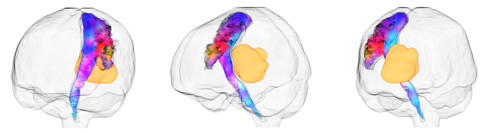

## Fiona Young's PhD thesis

### Provisional title: *Improving brain surgery with intraoperative diffusion MRI*

Undertaken at University College London, funded by the UCL EPSRC Centre for Doctoral Training in Intelligent, Integrated Imaging In Healthcare [(i4health)](https://www.ucl.ac.uk/intelligent-imaging-healthcare/epsrc-centre-doctoral-training-intelligent-integrated-imaging-healthcare-i4health)

Supervisors: Prof. Jon D. Clayden, Mr. Kristian Aquilina, Prof. Chris A. Clark
